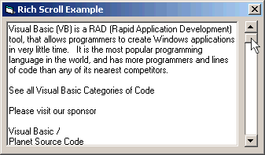



## \_Scroll RichText Box With External Scrollbar

### Description

This is a simple method of scrolling text in a rich text box without using it's scrollbar. I made it for a project of mine where I needed a textbox that was disabled but still could scroll. So I came up with this. I'm not expecting any votes but please vote or leave comments if you want to.
 
### More Info
 

             |
---                |---
**Submitted On**   |2004-06-02 22:53:04
**By**             |[KRYO\_11](https://github.com/Planet-Source-Code/PSCIndex/blob/master/ByAuthor/kryo-11.md)
**Level**          |Intermediate
**User Rating**    |5.0 (25 globes from 5 users)
**Compatibility**  |VB 5\.0, VB 6\.0
**Category**       |[Miscellaneous](https://github.com/Planet-Source-Code/PSCIndex/blob/master/ByCategory/miscellaneous__1-1.md)
**World**          |[Visual Basic](https://github.com/Planet-Source-Code/PSCIndex/blob/master/ByWorld/visual-basic.md)
**Archive File**   |[\_Scroll\_Ri175300632004\.zip](https://github.com/Planet-Source-Code/kryo-11-scroll-richtext-box-with-external-scrollbar__1-54152/archive/master.zip)

